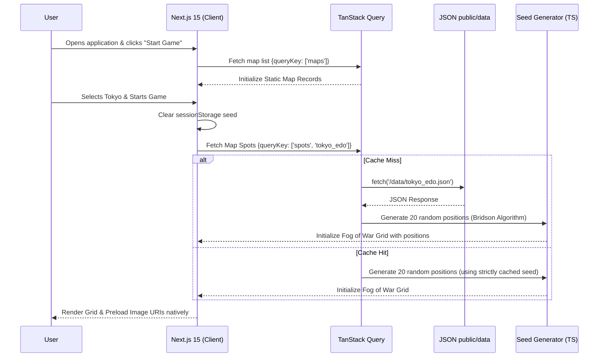

# Architecture Plan: Shogun's Scout

## 1. System Architecture Overview

This architecture maps directly to the required stack defined in `AGENTS.md`. The design fulfills the constraints of "zero runtime generative AI", leveraging static configurations and a highly optimized local database for fast load times and predictable latency.

### Core Tech Stack Map
- **Frontend (UI, Logic, & Data):** Next.js 15 (App Router) + TypeScript + TailwindCSS / `shadcn/ui`.
- **Client Data & Routing:** `TanStack Query` (for caching static payloads) + `nuqs` (for map/theme URL state management).
- **Backend API:** None. Architecture is 100% Serverless / Client-Side.
- **Database:** None. Replaced with strictly mapped static JSON files.

---

## 2. Static JSON Data Strategy
The Python SQLite database acting as a game wrapper was strictly deprecated. To serve the game rapidly without external permissions or setup on Vercel, the map data relies completely on highly curated `.json` payloads loaded directly into the frontend from `public/data/`.

```json
{
  "city": "Tokyo",
  "region": "Kanto",
  "spots": [
    {
      "name": "Senso-ji Temple",
      "coords": { "x": 0, "y": 0 },
      "category": "Temple",
      "trivia": "Tokyo's oldest Buddhist temple."
    }
  ]
}
```
*Note: The `coords` stored in the JSON are ignored by the engine at runtime to ensure procedural layout generation.*

---

## 3. Map Pipeline & Procedural Generation

To satisfy the constraint of no dynamic GenAI at runtime and ensure high aesthetic fidelity, the map data is managed statically through JSON files, but visually randomized at load time.
- **Spot positions (`pos_x`, `pos_y`) are NOT taken from the JSON `coords` field.** Instead, the frontend dynamically runs a client-side TypeScript generation module (`frontend/lib/seed.ts`) that executes a **stratified-quadrant Poisson-disc algorithm** (min separation ≥ 11 units, 6-unit margin from all edges) instantly inside the browser. Three seed points are placed in each of the 4 quadrants first (securing 12 points across the perimeter), then Bridson expansion fills the remaining spots. To avoid over-concentration, the algorithm enforces a strict minimum rejection distance of 8.0 units even during fallback phases. This **guarantees** spots are perfectly distributed across the full extent of the screen.
- **Dynamic In-Session Reseeding**: Whenever a user clicks "Commence Scouting" in the UI (War Room), the frontend exclusively clears the active session seed constraint in `sessionStorage` (`sessionStorage.removeItem`). This securely triggers the seed randomisation algorithm inside the browser upon viewing the map, meaning every single gameplay session generates an entirely fresh layout.
- The game consumes images directly as standard `<Image>` tags or standard `` tags over Next.js public routes.

---

## 4. Flowcharts (Mermaid)

### Map Request & Render Logic



---

## 5. Token & Performance Strategy

To drastically save on load times and theoretical inference/processing costs across the system, the caching layer is explicitly defined:

1. **Client-Side Request Memoization:** All gameplay configuration (Map locations, Spot coordinates, Trivia logic) is fetched once via TanStack Query and cached in-memory for the duration of the browser session. If a user replays a map, the native `fetch` intercepts via cache resulting in instantaneous response times with 0 remote network trips.
2. **Static Native Asset Caching:** Because image ingestions map directly to Next.js's public `/assets/` directory rather than utilizing an active DB BLOB blob retrieval or Cloud proxy, standard HTTP `Cache-Control: public, max-age=31536000, immutable` headers will passively handle all image caching at the browser level.
3. **Local State:** Handled natively through the window `localStorage` API to circumvent continuous DB writes, creating zero active network requests when a user hits the "Victory Screen".

---

## 6. Theme Engine & App State Management

While Maps and Sites are data-driven from the database, the **Atmospheric Themes** (e.g., Nature Mist, Cyber Smoke, Lantern Dusk, Castle Shadows) are purely frontend-driven display overrides.

### 6.1 The War Room (Configuration State)
The user selects both the Map and the Theme simultaneously in the **War Room** component. Because there are no centralized User Accounts, the Next.js app needs a scalable way to track this exact combination:
- **nuqs URL State:** Instead of complex React Context overhead, the selected configuration is serialized directly into the URL parameters using the Next.js query-string library `nuqs`. 
  - Example state: `/play?map=tokyo&theme=lantern-dusk`
  - This allows a user to refresh the page or share a link to a specific "Tokyo at Lantern Dusk" challenge without losing that exact configuration.

### 6.2 CSS Variable Interswap
Themes do not require unique game-logic compilation. They rely entirely on standard CSS Variable injection mapped to Tailwind configurations:
- The Next.js app mounts a client component (`<ThemeWrapper>`) that reads the `nuqs` state.
- If `theme=cyber-smoke` is active, the app overrides the DOM's `--fog-color` CSS variable to a digital blue/grey and applies neon grid outlines. 
- The 100x100 Grid's **Fog of War** logic natively maps to `var(--fog-color)` to render its obscuring gradient masking. This guarantees that one map geometry (e.g., Kyoto) works seamlessly across all aesthetic realities with zero additional database payload.
