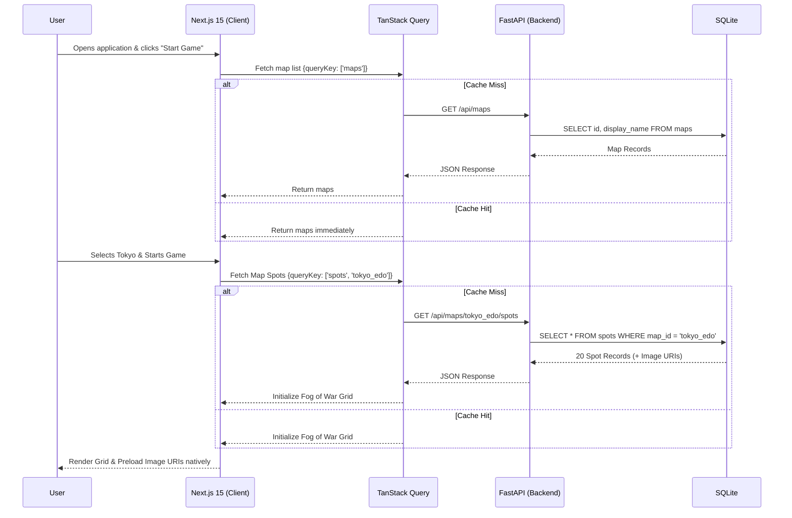

# Architecture Plan: Shogun's Scout

## 1. System Architecture Overview

This architecture maps directly to the required stack defined in `AGENTS.md`. The design fulfills the constraints of "zero runtime generative AI", leveraging static configurations and a highly optimized local database for fast load times and predictable latency.

### Core Tech Stack Map
- **Frontend (UI & Logic):** Next.js 15 (App Router) + TypeScript + TailwindCSS / `shadcn/ui`.
- **Client Data & Routing:** `TanStack Query` (for caching API routes) + `nuqs` (for map/theme URL state management).
- **Backend API:** Python 3.12+ (FastAPI) serving map configuration endpoints.
- **Database:** Local SQLite (`dev.db`).

---

## 2. SQLite Database Schema
The database acts as the strict source of truth for the Map Shell configurations. Since User profiles and game state are managed via client-side Storage, the DB is exclusively for game content.

```sql
-- Represents the playable regions (e.g., Tokyo, Kyoto)
CREATE TABLE maps (
    id VARCHAR(50) PRIMARY KEY, -- Sluggified from JSON 'city', e.g., "tokyo"
    display_name VARCHAR(100) NOT NULL, -- From JSON 'city', e.g., "Tokyo"
    region VARCHAR(100), -- From JSON 'region', e.g., "Kanto"
    created_at TIMESTAMP DEFAULT CURRENT_TIMESTAMP
);

-- Represents the 20 distinct locations within a specific map
CREATE TABLE spots (
    id INTEGER PRIMARY KEY AUTOINCREMENT,
    map_id VARCHAR(50) NOT NULL,
    name VARCHAR(100) NOT NULL,
    pos_x INTEGER NOT NULL, -- Generated at seed-time via stratified-quadrant Poisson-disc (6–94 range)
    pos_y INTEGER NOT NULL, -- Generated at seed-time via stratified-quadrant Poisson-disc (6–94 range)
    category VARCHAR(50) NOT NULL, -- "Shrine", "Temple", "Fortress", etc.
    trivia TEXT, -- From JSON 'trivia'
    image_uri VARCHAR(255) NOT NULL, -- Relative path for frontend ingestion 
    FOREIGN KEY (map_id) REFERENCES maps(id) ON DELETE CASCADE
);

-- Indexes for Local Performance
CREATE INDEX idx_spots_map_id ON spots (map_id);
```

---

## 3. Map Pipeline & Procedural Generation

To satisfy the constraint of no dynamic GenAI at runtime and ensure high aesthetic fidelity, the map data is managed statically through python seed scripts.
- **Spot positions (`pos_x`, `pos_y`) are NOT taken from the JSON `coords` field.** Instead, `data/seed.py` generates well-dispersed random positions using a **stratified-quadrant Poisson-disc algorithm** (min separation ≥ 16 units, 4-unit margin from all edges). Two seed points are placed in each of the 4 quadrants of the playfield first (securing 8 spots around the perimeter), then Bridson expansion fills the remaining spots radially outward up to 2.5x the minimum radius. This **guarantees** spots appear heavily in all corners and the full extent of the screen.
- **Dynamic In-Session Reseeding**: Whenever a user clicks "Commence Scouting" in the UI (War Room), the frontend exclusively hits `POST /api/maps/{map_id}/randomize`. This securely triggers the seed randomisation algorithm on the server for that map, meaning every single gameplay session generates an entirely fresh layout without restarting the server.
- The game consumes images directly as standard `<Image>` tags or standard `` tags over Next.js public routes.

---

## 4. Flowcharts (Mermaid)

### Map Request & Render Logic



---

## 5. Token & Performance Strategy

To drastically save on load times and theoretical inference/processing costs across the system, the caching layer is explicitly defined:

1. **Client-Side Request Memoization:** All gameplay configuration (Map locations, Spot coordinates, Trivia logic) is fetched once via TanStack Query and cached in-memory for the duration of the browser session. If a user replays a map, `GET /api/maps/{id}/spots` is strictly intercepted by TanStack Query resulting in 0 database trips.
2. **Static Native Asset Caching:** Because image ingestions map directly to Next.js's public `/assets/` directory rather than utilizing an active DB BLOB blob retrieval or Cloud proxy, standard HTTP `Cache-Control: public, max-age=31536000, immutable` headers will passively handle all image caching at the browser level.
3. **Local State:** Handled natively through the window `localStorage` API to circumvent continuous DB writes, creating zero active network requests when a user hits the "Victory Screen".

---

## 6. Theme Engine & App State Management

While Maps and Sites are data-driven from the database, the **Atmospheric Themes** (e.g., Nature Mist, Cyber Smoke, Lantern Dusk, Castle Shadows) are purely frontend-driven display overrides.

### 6.1 The War Room (Configuration State)
The user selects both the Map and the Theme simultaneously in the **War Room** component. Because there are no centralized User Accounts, the Next.js app needs a scalable way to track this exact combination:
- **nuqs URL State:** Instead of complex React Context overhead, the selected configuration is serialized directly into the URL parameters using the Next.js query-string library `nuqs`. 
  - Example state: `/play?map=tokyo&theme=lantern-dusk`
  - This allows a user to refresh the page or share a link to a specific "Tokyo at Lantern Dusk" challenge without losing that exact configuration.

### 6.2 CSS Variable Interswap
Themes do not require unique game-logic compilation. They rely entirely on standard CSS Variable injection mapped to Tailwind configurations:
- The Next.js app mounts a client component (`<ThemeWrapper>`) that reads the `nuqs` state.
- If `theme=cyber-smoke` is active, the app overrides the DOM's `--fog-color` CSS variable to a digital blue/grey and applies neon grid outlines. 
- The 100x100 Grid's **Fog of War** logic natively maps to `var(--fog-color)` to render its obscuring gradient masking. This guarantees that one map geometry (e.g., Kyoto) works seamlessly across all aesthetic realities with zero additional database payload.
